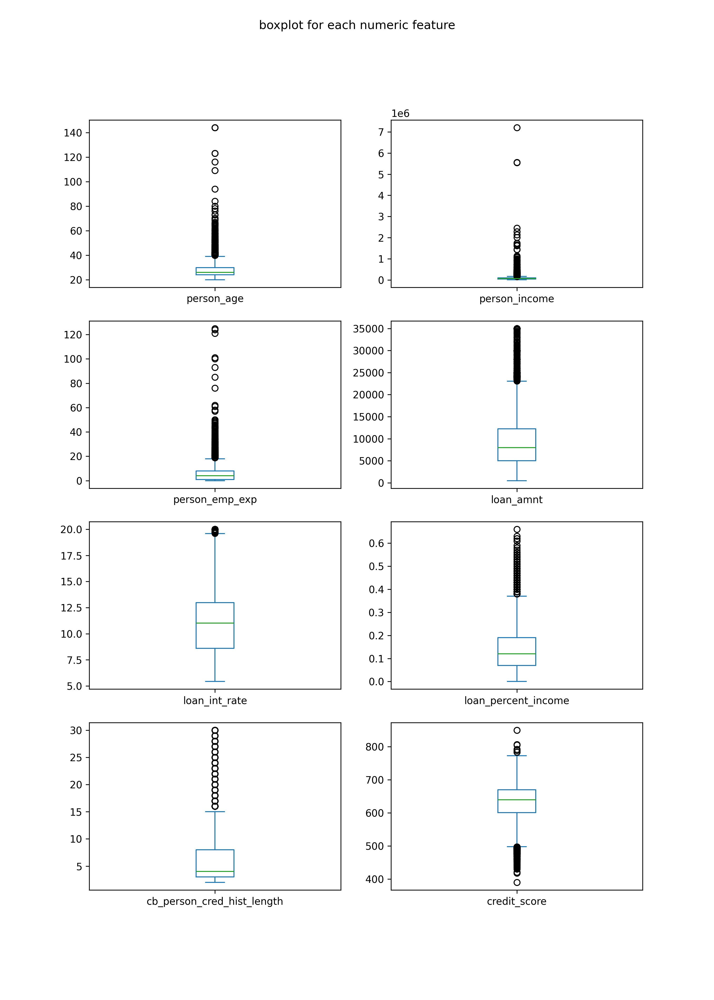
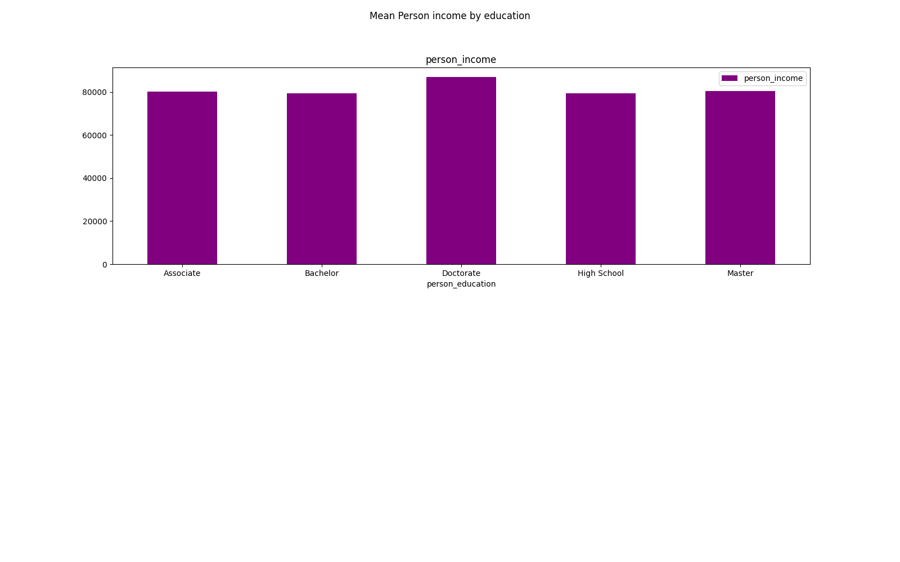
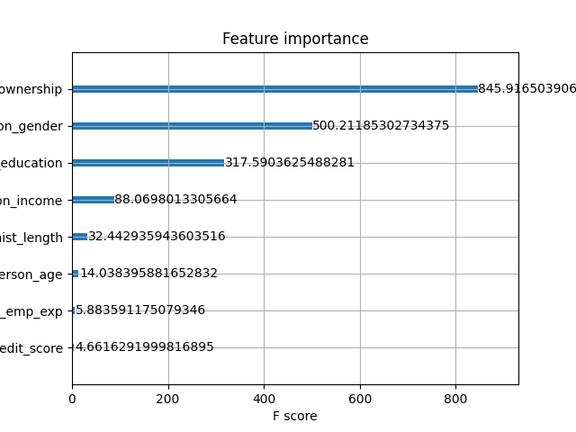
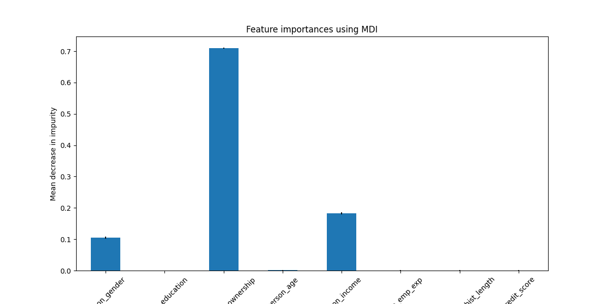
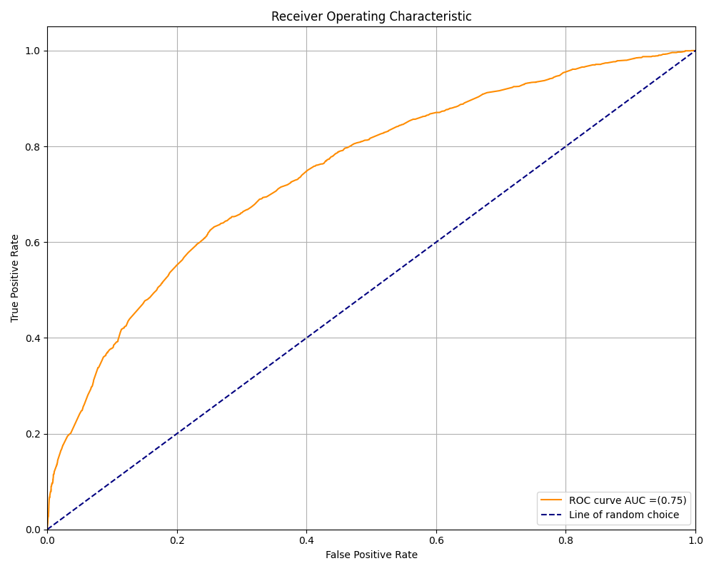
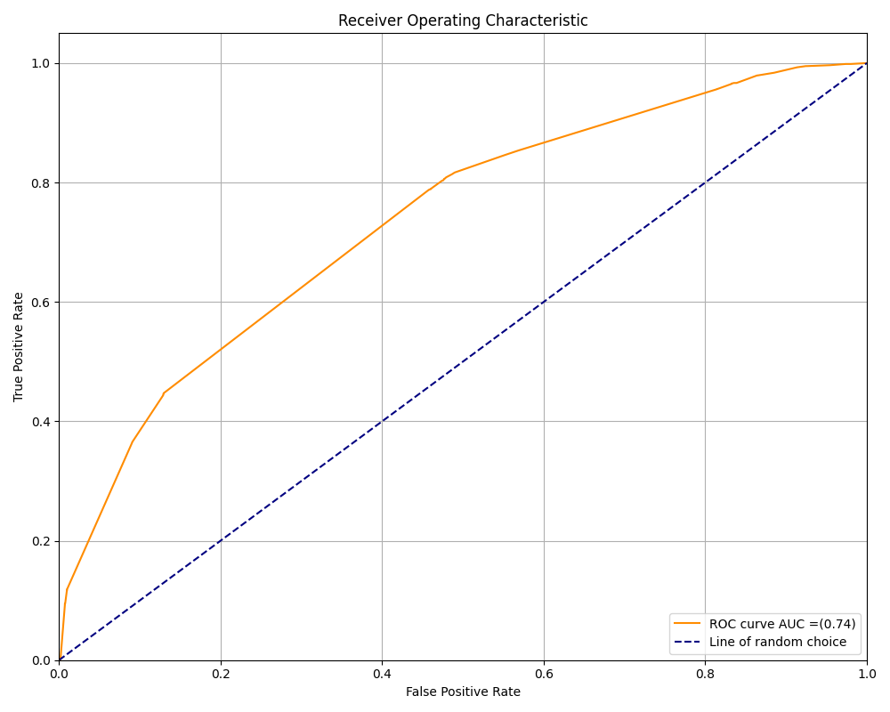

# Loan Approval Prediction: Classification Model

This project is a significantly improved version of a previous binary classification model built to predict whether a person will be granted a loan (`loan_status`).

Improvements over the earlier version include:
- SMOTE oversampling to address class imbalance
- XGBoost model with tuned parameters
- Additional model (Random Forest) for performance comparison
- ROC-AUC evaluation for both models
- Feature importance analysis
- Deeper exploratory data analysis (EDA)
- More robust data cleaning and preprocessing

---

## Problem Statement

Given demographic and financial data about a person, the goal is to predict whether they will receive a loan (`loan_status`: 0 or 1).

---

## Dataset Overview

- Features include:
  - Demographics: age, gender
  - Financials: income, home ownership, number of dependents
  - Employment: years of experience
- Target: `loan_status` (1 — loan approved, 0 — denied)

---

## EDA Highlights

- **Anomalies** were found in `person_age` and `person_emp_exp` — removed ages > 60 and experience > 40.
- **Income distribution** was right-skewed but normalized after log-scaling.
- **Gender gap**: Slightly higher average income for males.
- **Education** had almost no impact on average income.

---

## Data Preprocessing

- Removed redundant features with `"loan"` in their names.
- Separated categorical and numerical features.
- Encoded categorical variables with `OrdinalEncoder`.
- Addressed class imbalance with `SMOTE` (applied only to training data).
- Split into train/test (80/20).

---

## Model Training

### XGBoost Classifier
- `n_estimators=4`, `max_depth=6`, `learning_rate=1`
- Trained on balanced dataset
- AUC ≈ **0.75**

### RandomForest Classifier
- `n_estimators=4`, `max_depth=5`
- AUC ≈ **0.73**

---

## Feature Importance

### XGBoost
Top important features:
- `person_income`
- `person_education`
- `person_home_ownership`

### Random Forest

---

## Model Evaluation

### ROC-AUC Curves

**XGBoost**

**Random Forest**

- XGBoost outperforms Random Forest slightly and is selected as the final model.
- Final model is saved as: `XGB_model.bin`

---

## Files

- `Classification_model.ipynb` — full notebook with code, visuals, and explanations
- `/images/` — saved plots
- `XGB_model.bin` — trained XGBoost model
- `ordinal_encoder.pkl` (recommended to be saved) — encoder for categorical preprocessing

---

## Conclusions

- The classification task is viable and shows stable performance using tree-based models.
- The most predictive features are income-related, not demographic.
- SMOTE significantly improved balance in training data, which enhanced the model's ability to generalize.

---

## Stack

- Python, Pandas, NumPy, Seaborn, Matplotlib
- scikit-learn
- XGBoost
- imbalanced-learn (`SMOTE`)

---
